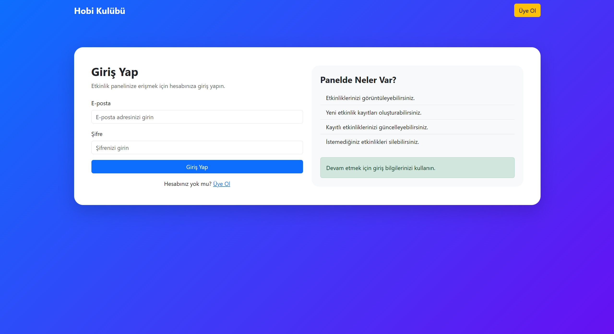
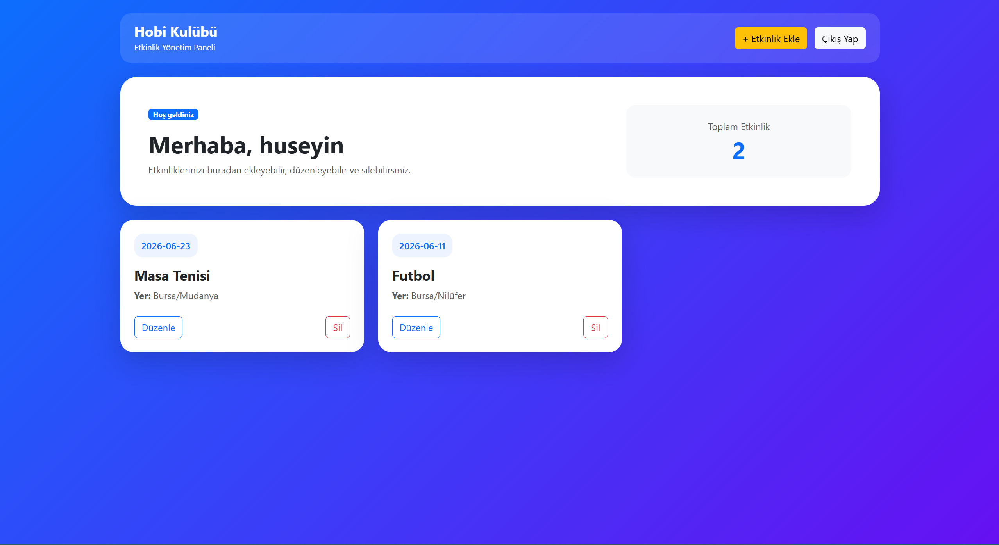

# Hobi-Kulubu-Yonetim-Sistemi

## Proje Tanıtımı

Hobi Kulübü Yönetim Sistemi, kullanıcıların kulüp etkinliklerini yönetebilmesi amacıyla geliştirilmiş web tabanlı bir uygulamadır.

Kullanıcılar sisteme üye olabilir, giriş yapabilir ve kendilerine ait etkinlikleri oluşturabilir, görüntüleyebilir, güncelleyebilir ve silebilirler.

---

## Kullanılan Teknolojiler

- PHP
- MySQL
- HTML5
- CSS3
- Bootstrap 5

---

## Uygulama Özellikleri

### Kullanıcı İşlemleri

- Üye Olma
- Giriş Yapma
- Çıkış Yapma
- Oturum Yönetimi (Session)

### Etkinlik İşlemleri

- Etkinlik Ekleme
- Etkinlik Listeleme
- Etkinlik Güncelleme
- Etkinlik Silme

---

## Güvenlik

- Kullanıcı şifreleri düz metin olarak saklanmaz.
- Şifreler `password_hash()` fonksiyonu ile hashlenir.
- Giriş işlemlerinde `password_verify()` kullanılır.
- Kullanıcı oturumları PHP Session ile yönetilir.
- Kullanıcılar yalnızca kendi kayıtları üzerinde işlem yapabilir.

---

## Veritabanı Tabloları

### users

| Alan | Açıklama |
|--------|--------|
| id | Kullanıcı ID |
| username | Kullanıcı Adı |
| email | E-posta |
| password | Hashlenmiş Şifre |

### etkinlikler

| Alan | Açıklama |
|--------|--------|
| id | Etkinlik ID |
| user_id | Kullanıcı ID |
| etkinlik_adi | Etkinlik Adı |
| etkinlik_tarihi | Etkinlik Tarihi |
| yer | Etkinlik Yeri |
| aciklama | Açıklama |

---

## Kurulum

1. XAMPP kurulmalıdır.
2. Apache ve MySQL servisleri başlatılmalıdır.
3. `hobi_kulubu` isimli veritabanı oluşturulmalıdır.
4. `users` ve `etkinlikler` tabloları oluşturulmalıdır.
5. Proje dosyaları `htdocs` klasörüne kopyalanmalıdır.
6. Tarayıcı üzerinden uygulama çalıştırılmalıdır.

---

## Ekran Görüntüleri

### Kullanıcı Giriş Ekranı

### Etkinlik Yönetim Paneli

---

## Video Tanıtımı

Video bağlantısı:

(Videoyu yükledikten sonra buraya bağlantı eklenecektir.)

---

## Proje İçeriği

Bu uygulama kullanıcıların kulüp etkinliklerini tek bir panel üzerinden yönetebilmesini sağlamaktadır. Kullanıcılar sisteme giriş yaptıktan sonra yeni etkinlik oluşturabilir, mevcut etkinlikleri görüntüleyebilir, güncelleyebilir ve silebilirler.

---

## Geliştirici

Hüseyin Kocak

Web Tabanlı Programlama Dönem Projesi
2026
